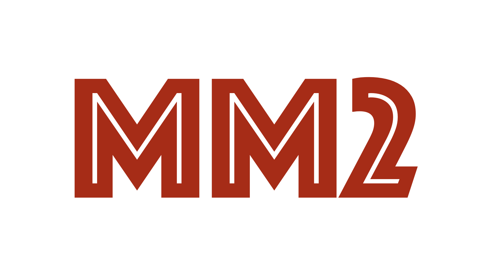

# MolSSI Summer School 2019
A project completed or the 2019 MolSSI Software Summer School was held from 
July 22-31 at The Texas Advanced Computing Center.

The School’s focus was on best practices in software engineering – 
version control, continuous integration, data management, programming paradigms.
## Molecular Mechanics Project (Group 2)

